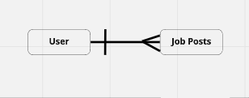
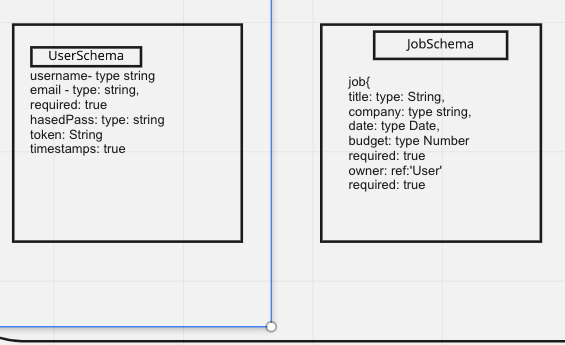
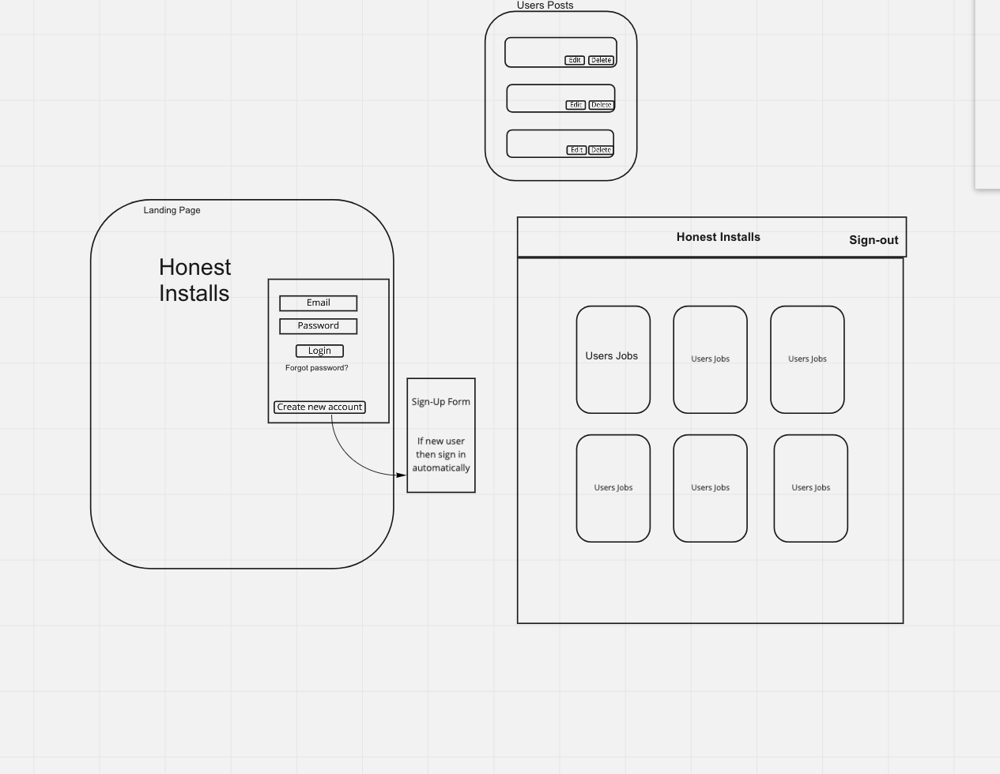

 
# Honest Installs Job Board
---
# Deployed Site
https://hishamraihan.github.io/honest_frontend/
https://dashboard.heroku.com/apps/dry-tundra-83070

# Repo Links
https://github.com/HishamRaihan/honest_backend
https://github.com/HishamRaihan/honest_frontend

## The BackStory
- This project has allowed us to incorporate everything we have learned in this bootcamp up until now.
- We used JavaScript and React for the front-end while using Express Mongo/Mongoose  curl scirpts for the back-end.
- To me it was much more than a project - it was a big learning experience.
- Full Stack with custome API.

## npm packages used 
## start with npm install and the following:
--
- react-bootstrap-icons
- timeago.js
- react-responsive-carousel
- react-currency-input-field
---
## Instructions
MVP User Stories
1. As an unregistered user, I would like to sign up with username, email and password.
2. As a registered user, I would like to sign in with username and password.
3. As a signed in user, I would like to change password.
4. As a signed in user, I would like to sign out.
5. As a signed in user, I would like to add a job post to my board.
6. As a signed in user, I would like to update a job post on my board.
7. As a signed in user, I would like to delete a job post on my board.
8. As a signed in user, I would like to see all my jobs on job board.
8. As a signed in user, I would like to see all jobs on job board.
9. As a signed in user, I would like to view a list of other users and view their jobs.

## WireFrame
Honest Installs Wireframe 

 1. Client must be able to sign-up successfully
 - upon. Clicking sign-up  submit button if successful user will be prompt with sign up message
 - if sign-up failed then user will be prompt with error message

 2. Client must be able to sign in successfully
 - once sign-in submit button is clicked user will be prompt with a success or error message
 - client will be directed to the Honest Installs Homepage

 3. Client post page
 - client will use nav links to sign-out and change-password
 - client must see fetch, add and delete buttons to interact with the database

4. Client will interact with the database
 - client can add a job post to the job board: upon adding a job the client will fill out the job form and submit
 - client submission will be saved into the database
- client will be able to update
 5. Client will be able to fetch/get all jobs
- all jobs will show on job board
- client can get one job post by the ID

 6. Client will be able to delete a post
 - once deleted client should not be able to see it them when fetching the job post.